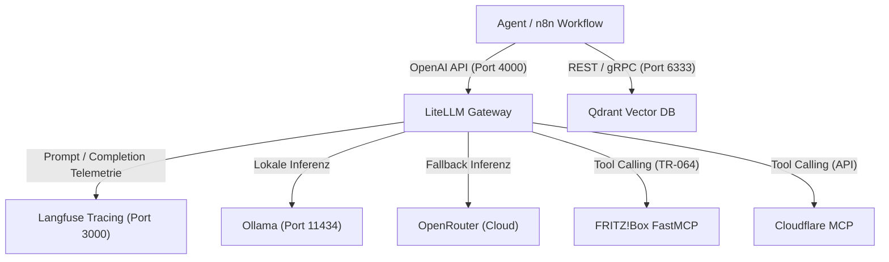

# 🤖 Agent Developer Guide: LiteLLM, Qdrant, Langfuse & MCP

Dieser Leitfaden beschreibt, wie Entwickler autonome Agenten (z. B. mit **n8n**, **LangGraph**, **LlamaIndex** oder purem **Python**) an den lokalen Infrastruktur-Stack anbinden.

---

## 🏛️ Architekturübersicht für Agenten



### Die Kernkomponenten

1. **LiteLLM Gateway (`http://localhost:4000/v1`)**:
   - Einheitliche OpenAI-kompatible Schnittstelle für alle LLMs.
   - Integriertes Routing, Smart Fallback (Lokal -> Cloud bei Ausfall/Überlastung) und Tool Execution via MCP.
2. **Qdrant Vector Engine (`http://localhost:6333`)**:
   - Speichereffiziente Vektordatenbank für RAG-Wissensbasen, Langzeit-Gedächtnis (*episodic & semantic memory*) und semantische Suche.
   - Integrierte Web-Konsole unter `http://localhost:6333/dashboard`.
3. **Langfuse Observability (`http://localhost:3000`)**:
   - Tracing aller LLM-Calls, Token-Verbrauch, Latenzen und Fehleranalysen.
   - Zentrales Prompt Management.
4. **FastMCP Server**:
   - `fritzbox_mcp`: Netzwerkdiagnose, aktive Geräte, Bandbreite, Gast-WLAN, DECT Smart-Home.
   - `cloudflare_mcp`: DNS-Records, Zero Trust Policies und Tunnels.
   - `filesystem_mcp`: Isolierte Dateioperationen im `./workspace`-Verzeichnis.

---

## 🔌 Anbindung an n8n Workflows

n8n eignet sich hervorragend zur visuellen Orchestrierung von KI-Agenten und Event-Pipelines.

### 1. LiteLLM als OpenAI Chat Model einrichten

* **Node:** `OpenAI Chat Model` (oder `LangChain OpenAI Model`)
* **Credential:** Neues OpenAI Credential erstellen:
  * **API Key:** Dein `$LITELLM_MASTER_KEY` aus der `.env` (z. B. `sk-litellm-master-key-...`)
  * **Base URL:**
    * Läuft n8n auf dem Host: `http://localhost:4000/v1`
    * Läuft n8n in einem Podman/Docker-Container: `http://host.docker.internal:4000/v1` oder `http://host.containers.internal:4000/v1`
* **Modellname eintragen:**
  * `local-general`: Standard Allrounder (`llama-3.3-70b` bzw. `llama3.1:8b`)
  * `local-coder`: Programmierung & strukturierte Ausgaben (`qwen2.5-coder:32b` bzw. `7b`)
  * `local-general-fast`: Für schnelle Zwischenschritte (`llama3.2:3b`)
  * `smart-general`: Automatischer Failover zu OpenRouter

### 2. Qdrant Vector Store in n8n einbinden

* **Node:** `Qdrant Vector Store`
* **Credential:**
  * **Qdrant Server URL:** `http://localhost:6333` (oder Container-Host)
  * **API Key:** leer lassen (lokaler Betrieb ohne Auth)
* **Embeddings Node:** `Embeddings OpenAI`
  * **Model Name:** `nomic-embed-text`
  * **Base URL:** `http://localhost:4000/v1`

---

## 🐍 Eigene Agenten mit Python & LangGraph

Ein vollständiges, produktionsreifes Beispiel für einen Agenten mit LangGraph, Vektorsuche in Qdrant und automatischem Tracing in Langfuse.

### Voraussetzungen

```bash
pip install langchain-openai qdrant-client langfuse langgraph
```

### Agenten-Implementierung (`agent_example.py`)

```python
import os
from langchain_openai import ChatOpenAI, OpenAIEmbeddings
from qdrant_client import QdrantClient
from qdrant_client.http import models as qmodels
from langfuse.callback import CallbackHandler

# 1. Verbindungskonfiguration aus Umgebung
LITELLM_API_BASE = os.getenv("LITELLM_API_BASE", "http://localhost:4000/v1")
LITELLM_API_KEY = os.getenv("LITELLM_MASTER_KEY", "sk-litellm-master-key-change-me-in-production")
QDRANT_URL = os.getenv("QDRANT_URL", "http://localhost:6333")

# 2. Langfuse Observability Callback
langfuse_handler = CallbackHandler(
    public_key=os.getenv("LANGFUSE_PUBLIC_KEY"),
    secret_key=os.getenv("LANGFUSE_SECRET_KEY"),
    host=os.getenv("LANGFUSE_HOST", "http://localhost:3000")
)

# 3. LLM & Embeddings initialisieren
llm = ChatOpenAI(
    model="local-general",
    openai_api_base=LITELLM_API_BASE,
    openai_api_key=LITELLM_API_KEY,
    temperature=0.2,
    callbacks=[langfuse_handler]
)

embeddings = OpenAIEmbeddings(
    model="nomic-embed-text",
    openai_api_base=LITELLM_API_BASE,
    openai_api_key=LITELLM_API_KEY
)

# 4. Qdrant Client verbinden
qdrant = QdrantClient(url=QDRANT_URL)

def ensure_collection(name: str):
    """Erstellt eine Qdrant Collection, falls noch nicht vorhanden."""
    collections = [c.name for c in qdrant.get_collections().collections]
    if name not in collections:
        qdrant.create_collection(
            collection_name=name,
            vectors_config=qmodels.VectorParams(
                size=768,  # nomic-embed-text Vektordimension
                distance=qmodels.Distance.COSINE
            )
        )
        print(f"Collection '{name}' erfolgreich angelegt.")

ensure_collection("agent_memory")

# 5. Agenten-Logik mit LangChain / LangGraph ausführen
response = llm.invoke("Welche Rolle spielst du in unserem DevOps-Setup?")
print(f"Antwort des Agenten:\n{response.content}")
```

---

## 🛠️ MCP-Tools via LiteLLM nutzen

Wenn Agenten Tools (Function Calling) benötigen, stehen die in `config/mcp_servers.yaml` definierten MCP-Server direkt über LiteLLM zur Verfügung.

### Beispiel: FRITZ!Box Netzwerk-Check per Tool Call

In `config/agents.yaml` ist der DevOps-Agent definiert:

```yaml
  - agent_name: agent-devops
    model: local-general
    tools:
      - cloudflare_mcp
      - github_mcp
      - fritzbox_mcp
```

Der Agent hat direkten Zugriff auf:
* `fritzbox_get_network_devices`: Listet alle WLAN-/LAN-Geräte mit IP, MAC und Verbindungsstatus.
* `fritzbox_get_wan_status`: Zeigt die aktuelle externe IP-Adresse und Verbindungsdauer.
* `fritzbox_get_device_logs`: Holt das System-Ereignisprotokoll der FRITZ!Box.
* `fritzbox_get_smart_home_devices`: Zeigt DECT-Steckdosen, Heizkörper und Schalter.

---

## 💡 Best Practices für Agenten-Entwickler

1. **Trennung von Kurzzeit- und Langzeitgedächtnis:**
   - **Kurzzeit / Context-Window:** Redis (`localhost:6379`) oder interner State in LangGraph.
   - **Langzeit / RAG:** Qdrant (`localhost:6333`). Vektoren immer mit `nomic-embed-text` indexieren.
2. **Modell-Wahl nach Task-Komplexität:**
   - Code-Generierung / Refactoring: `local-coder`
   - Reasoning / Multi-Step Orchestrierung: `local-general`
   - Textklassifikation / Tagging / Schnellfilter: `local-general-fast`
3. **Observability ist Pflicht:**
   - Übertrage bei jedem Agenten-Durchlauf Session-IDs und Metadaten an Langfuse:
     ```python
     callbacks = [CallbackHandler(session_id="run-1234", user_id="n8n-workflow")]
     ```
4. **Backups:**
   - Vor größeren Schema-Änderungen oder RAG-Migrationen immer `make backup` ausführen.
