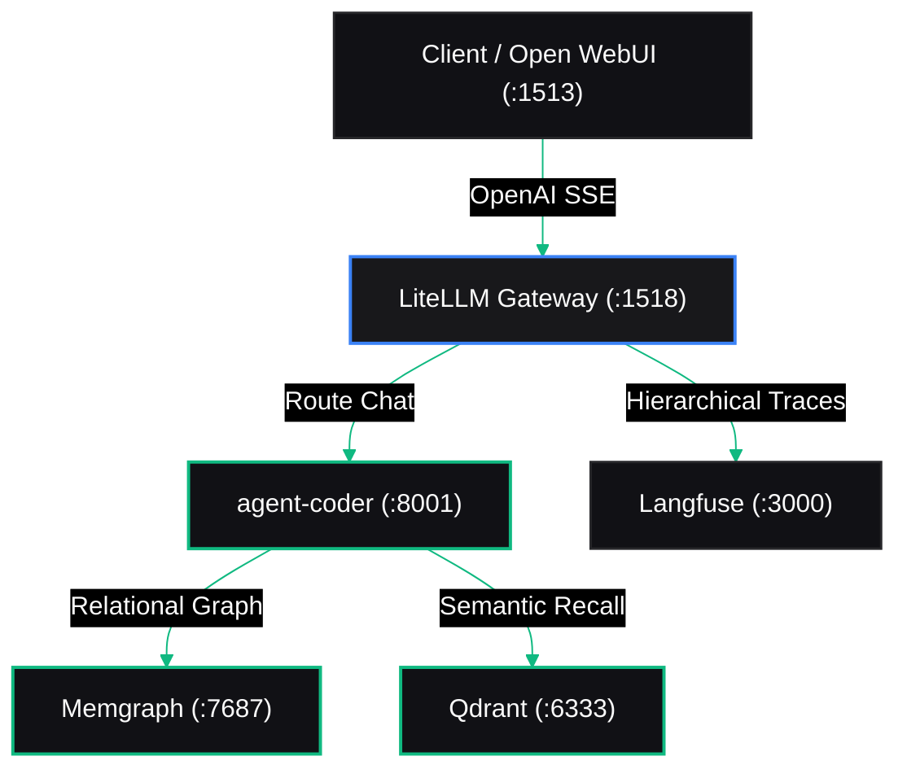

# 🎨 Krümel AI – Visual Identity & Diagram Design System

This design guide defines the consistent aesthetic, color palette, typography, and diagram styling for all **Krümel AI** Medium articles, documentation, GitHub repositories, and architectural illustrations.

---

## 🌌 1. The Color Palette ("Cyber-Slate & Emerald")

All graphics, banners, and diagrams follow the dark-mode aesthetic of the **Krümel Hub**:

| Token Name | Hex Code | Visual Swatch | Usage |
| :--- | :---: | :---: | :--- |
| **Canvas Background** | `#09090B` | `⬛ Deep Slate` | Outer frame, image canvas, diagram background |
| **Surface (Cards/Nodes)** | `#111115` | `⬛ Card Slate` | Diagram nodes, component boxes, containers |
| **Surface Elevated** | `#18181B` | `⬛ Header Slate` | Subgraph groupings, modal headers, badges |
| **Border & Dividers** | `#27272A` | `◻️ Subtle Border` | 1px node borders, grid lines, structural frames |
| **Primary Accent (Blue)**| `#3B82F6` | `🟦 Electric Blue` | Gateways, API endpoints, routers, client traffic |
| **Success Accent (Green)**| `#10B981` | `🟩 Emerald Green` | Online status, agents, database engines, storage |
| **Warning Accent (Amber)**| `#F59E0B` | `🟨 Amber` | Latency alerts, fallbacks, retries, soft spend caps |
| **Danger Accent (Rose)** | `#F43F5E` | `🟥 Rose` | Security perimeters, PII blocks, hard stops |
| **Text Primary** | `#FAFAFA` | `⬜ Off-White` | Headings, node labels, key metrics |
| **Text Muted** | `#A1A1AA` | `◽ Cool Gray` | Port numbers, descriptions, secondary annotations |

### Signature Brand Gradient:
```css
background: linear-gradient(135deg, #2563EB 0%, #10B981 100%);
```

---

## 📐 2. Typography

* **Headings & Body UI:** `Inter`, `-apple-system`, `BlinkMacSystemFont`, `sans-serif` (Weights: 500 Medium, 600 SemiBold, 700 Bold)
* **Code, Ports, Metrics & Terminal:** `JetBrains Mono`, `SF Mono`, `Menlo`, `monospace` (Weights: 400 Regular, 600 SemiBold)

---

## 📊 3. Standardized Mermaid Theme Template

To ensure that **every diagram** in your articles and READMEs renders in the exact look and feel of the Krümel Hub, prefix every Mermaid diagram with this initialization block:



---

## 🖼️ 4. Image & Screenshot Formatting Guidelines

When preparing images or exporting Canva / Figma / Excalidraw / Draw.io illustrations:

1. **Aspect Ratio:**
   * **Hero / Header Image (Medium Cover):** `16:9` (e.g., `1200 x 675 px` or `1920 x 1080 px`).
   * **Architecture Diagrams:** `16:9` or `4:3` with clean padding.
2. **Padding & Borders:**
   * Maintain at least `40px` of padding around diagrams.
   * Background must always be `#09090B` (Canvas Dark) instead of pure black `#000000` or stark white `#FFFFFF`.
   * Add a subtle 1px border (`#27272A`) and subtle rounded corners (`border-radius: 8px`).
3. **Screenshot Aesthetic:**
   * Always capture screenshots in **Dark Mode** (`data-theme="dark"`).
   * Ensure browser bookmarks and personal tabs are cropped out.
   * Frame screenshots with a subtle dark drop shadow: `box-shadow: 0 20px 40px rgba(0, 0, 0, 0.6)`.

---

## 📦 5. Official Boilerplate Repository Links

Whenever referring to the open-source code in Medium articles, use these canonical links:

* **Platform / Infrastructure Stack:**  
  `https://github.com/wortkotze/medium-kruemel-ai-infra`
* **Autonomous Multi-Agent Application Layer:**  
  `https://github.com/wortkotze/medium-kruemel-ai-agents`
