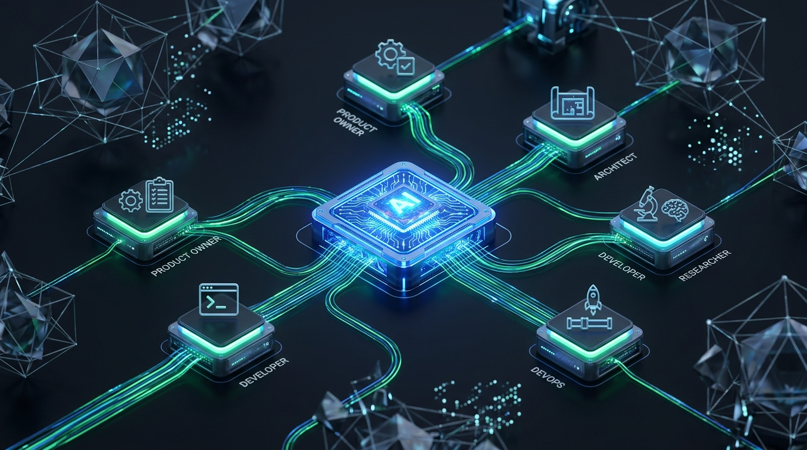
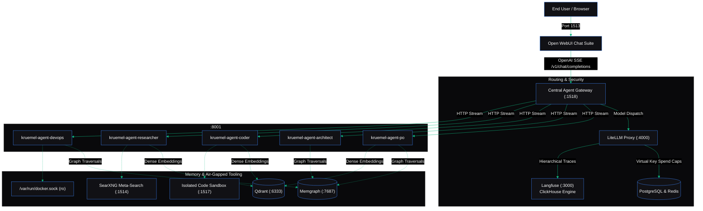
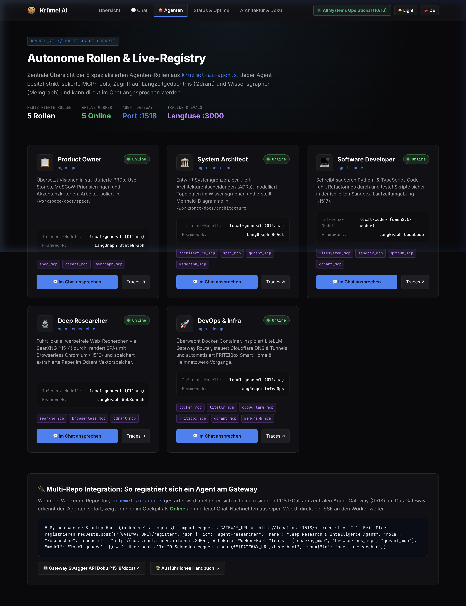

# Beyond Toy Bots: The Production-Ready Open-Source Multi-Agent Blueprint for 2026

**How we engineered an audited, zero-lock-in enterprise AI platform with LiteLLM, Langfuse, Memgraph, Qdrant, and LangGraph micro-workers.**

---


*Figure 1: The Krümel AI 3D Enterprise Topology — A central gateway routing requests across isolated containerized micro-workers backed by dual-layer vector and graph memory.*

---

## 1. The "Toy AI" Hangover

Every engineering organization begins its AI journey the exact same way. An engineer opens a Jupyter notebook, installs the OpenAI Python SDK, inputs an API key, and calls `client.chat.completions.create()`. It feels like magic. Within forty-eight hours, an internal demo or Streamlit prototype is deployed to show leadership.

Then comes Monday morning in production.

The moment multiple teams, automated background scripts, and autonomous agent loops hit that direct API endpoint, reality strikes with the subtlety of a sledgehammer:

1. **Unchecked Cloud Financial Drain:** An autonomous agent gets caught in a recursive tool loop or someone attempts to pass a 100,000-token repository into an unmonitored model. The monthly API bill exceeds departmental budgets before lunch.
2. **Data Privacy & Compliance Violations:** Employees paste real customer names, internal IP addresses, and private API tokens directly into prompts. The organization has just violated GDPR, SOC 2, and internal data loss prevention policies.
3. **The Black Box Dilemma:** An agent outputs invalid code or hallucinates a database schema. Why did it do that? What were the intermediate reasoning steps? Standard application logging (`logger.info`) captures none of the hierarchical execution context.
4. **Fragility and Vendor Lock-In:** Prompt strings, model IDs, and proprietary parameters are scattered across hundreds of lines of application code. When OpenAI experiences downtime or changes pricing, changing providers requires refactoring and redeploying the entire codebase.

Building a production-ready AI platform is not an LLM problem; it is a **distributed systems and infrastructure problem**.

In this article, we unveil the complete architecture of **Krümel AI**: a fully open-source, containerized enterprise AI stack that solves cost governance, data privacy, observability, dual-layer memory, and multi-agent isolation from the ground up.

---

## 2. The 5 Pillars of Enterprise AI Infrastructure

To transition from brittle prototype scripts to an enterprise-grade platform, an architecture must satisfy five foundational pillars:

| Capability | Enterprise Requirement | Open-Source Solution |
| :--- | :--- | :--- |
| **1. Model Gateway & FinOps** | Decoupled routing, local-first inference ($0.00), automatic cloud fallbacks, virtual keys with hard spend caps. | **LiteLLM Proxy** |
| **2. Zero-Trust Data Security** | Real-time PII masking, secret detection, and deterministic pseudonymization before prompts leave the perimeter. | **Gateway Interceptor & Presidio** |
| **3. Full-Stack Observability** | Hierarchical trace trees tracking every token, latency bottleneck, tool execution, and automated evaluation score. | **Langfuse (ClickHouse + Postgres)** |
| **4. Dual-Layer Memory** | Dense semantic similarity matching combined with structured relational knowledge graph traversals. | **Qdrant + Memgraph (GraphRAG)** |
| **5. Isolated Agent Mesh** | Independent, resource-capped containerized micro-workers adhering strictly to the Principle of Least Privilege. | **LangGraph + Docker Bridge** |

---

## 3. High-Level Architecture & Request Flow

The entire platform is organized into two cleanly separated repositories:
* **[`medium-kruemel-ai-infra`](https://github.com/wortkotze/medium-kruemel-ai-infra):** The platform repository orchestrating 15 Docker services, database backends, tool sandboxes, and the central agent gateway.
* **[`medium-kruemel-ai-agents`](https://github.com/wortkotze/medium-kruemel-ai-agents):** The intelligence layer housing the LangGraph state machines and role definitions.

Here is how traffic flows through the ecosystem:



---

## 4. The 5 Autonomous Micro-Worker Roles

Rather than building a single monolithic agent that attempts to perform all tasks poorly, Krümel AI decomposes enterprise software delivery into **five specialized autonomous roles**:


*Figure 2: The Krümel Hub Cockpit — Live operational status displaying all five agent micro-workers registered and online.*

### 1. Product Owner & Requirements Agent (`agent-po`)
* **Objective:** Transforms fuzzy business ideas into structured PRDs, MoSCoW-prioritized epics, and Gherkin-formatted acceptance criteria.
* **Storage Perimeter:** Write-restricted to `/workspace/docs/specs`.
* **Tools:** Specification writer, Qdrant semantic memory, Memgraph domain modeler.

### 2. System & Software Architect Agent (`agent-architect`)
* **Objective:** Designs component boundaries, evaluates cross-service dependencies, and generates Architecture Decision Records (ADRs).
* **Storage Perimeter:** Write access to `/workspace/docs/architecture`, read-only access to specs.
* **Tools:** Cypher graph queries against Memgraph, Mermaid topology generation.

### 3. Software Engineer & Code Agent (`agent-coder`)
* **Objective:** Writes idiomatic code, refactors legacy modules, and audits repositories against security rules.
* **Storage Perimeter:** Sandboxed execution inside `/workspace` and transient runtime container `/sandbox`.
* **Tools:** Filesystem operations, code execution sandbox, Qdrant code memory.

### 4. Deep Research & Intelligence Agent (`agent-researcher`)
* **Objective:** Conducts autonomous multi-step web investigations, summarizes technical whitepapers, and extracts competitive benchmarks.
* **Storage Perimeter:** Isolated to `/workspace/docs/research`.
* **Tools:** SearXNG private meta-search engine, Browserless headless Chromium scraper.

### 5. DevOps & Infrastructure Automation Agent (`agent-devops`)
* **Objective:** Inspects container health, verifies routing tables, checks cloud networking, and reports infrastructure bottlenecks.
* **Storage Perimeter:** Strictly limited read-only volume mount of `/var/run/docker.sock`.
* **Tools:** Docker engine inspector, LiteLLM route validator, Memgraph infrastructure graph.

---

## 5. The "Zero Code Change" FinOps Engine

One of the platform's most powerful architectural patterns is the **complete decoupling of application code from language model providers**. 

In traditional codebases, switching from GPT-4o to a local Ollama model requires modifying Python files, updating client initializations, and rebuilding Docker images.

In Krümel AI, our agents request abstract, semantic tiers:
```python
# Inside LangGraph agent node:
llm = ChatOpenAI(
    base_url=settings.LITELLM_API_BASE,
    api_key=settings.get_coder_key(),
    model="local-coder" # <-- Abstract alias
)
```

Inside [`config/models.yaml`](https://github.com/wortkotze/medium-kruemel-ai-infra/blob/main/config/models.yaml), the platform engineering team defines the exact routing matrix:

```yaml
model_list:
  - model_name: local-coder
    litellm_params:
      model: ollama/qwen2.5-coder:7b
      api_base: http://host.containers.internal:11434
    
  - model_name: local-coder
    litellm_params:
      model: deepseek/deepseek-chat
      api_key: os.environ/DEEPSEEK_API_KEY
      # Fallback triggers automatically if local Ollama times out
```

### The 90/10 Cost Rule in Action
1. **90% Routine Workloads:** Simple formatting, classification, and initial tool selection run locally on-premise for **$0.00**.
2. **10% Complex Heavy-Lifting:** When an agent encounters deep algorithmic challenges or long-context documents, LiteLLM routes seamlessly to cloud frontier models (DeepSeek, Claude 3.7 Sonnet, GPT-4o).
3. **Hard Spend Caps:** If an agent exceeds its assigned monthly budget, LiteLLM rejects further cloud requests and falls back to local models.

---

## 6. Dual Memory: Why Vectors Need Graphs

A common mistake in current AI architectures is relying solely on vector databases for retrieval-augmented generation (RAG).

Vector databases (such as Qdrant) excel at **semantic fuzzy similarity**:
> *"Find me documentation paragraphs conceptually related to 'Bearer Token Authentication'."*

However, vector embeddings fail catastrophically when presented with **relational and hierarchical queries**:
> *"If we modify the database schema in Service A, which dependent microservices will break, and who is the designated code owner?"*

Vectors have no concept of directed edges, foreign keys, or multi-hop traversals.


*Figure 3: Dual-Layer Memory — Dense semantic vector clustering in Qdrant combined with relational property graph traversals in Memgraph.*

To solve this, Krümel AI implements a **Dual-Brain Architecture**:
* **Qdrant (`:6333`):** Acts as the episodic memory and knowledge store for unstructured research reports, code snippets, and conversational history.
* **Memgraph (`:7687`):** An in-memory graph database running openCypher that maps architectural components, microservice contracts, schemas, and team ownership.

Agents query both simultaneously to synthesize context that is both semantically rich and structurally accurate.

---

## 7. Get Started Locally in 5 Minutes

You can boot the entire Krümel AI enterprise stack on your workstation (macOS, Linux, or WSL2) with three terminal commands:

```bash
# 1. Clone the platform and agent repositories
git clone https://github.com/wortkotze/medium-kruemel-ai-infra.git
git clone https://github.com/wortkotze/medium-kruemel-ai-agents.git

# 2. Boot the core platform services (LiteLLM, Langfuse, Memgraph, Qdrant, Open WebUI)
cd medium-kruemel-ai-infra
cp .env.example .env
make start

# 3. Build and launch the 5 containerized agent micro-workers
make agents-build
make agents-up
```

Open your browser to:
* **Krümel Hub Operations Portal:** `http://localhost:1512`
* **Krümel Chat Suite (Open WebUI):** `http://localhost:1513`
* **Langfuse Observability Console:** `http://localhost:3000`
* **Memgraph Visual Lab:** `http://localhost:1515`

Select `@agent-researcher` or `@agent-coder` in the chat dropdown and watch your isolated agents execute live!

---

## What's Next in the Deep-Dive Series

This blueprint provides the high-level roadmap. Over the next six weeks, we will break down each critical subsystem into an exhaustive engineering guide:

1. **Part 1:** *Slashing 90% of LLM Costs with Zero Code Changes (LiteLLM & FinOps)*
2. **Part 2:** *Zero-Trust Prompting: Stopping PII Leaks and Compliance Traps*
3. **Part 3:** *No More Black Boxes: Full-Stack Observability & Evals with Langfuse*
4. **Part 4:** *Vectors Are Not Enough: Why Production Agents Need Knowledge Graphs*
5. **Part 5:** *Death to the Agent Monolith: Why Every Agent Belongs in Its Own Docker Container*
6. **Part 6:** *When Agents Go to Sleep: How Autonomous Systems Learn from Failures and Evolve*

Star the repositories on GitHub to follow along with the code releases:
* ⭐️ **Infrastructure Stack:** [https://github.com/wortkotze/medium-kruemel-ai-infra](https://github.com/wortkotze/medium-kruemel-ai-infra)
* ⭐️ **Autonomous Agent Mesh:** [https://github.com/wortkotze/medium-kruemel-ai-agents](https://github.com/wortkotze/medium-kruemel-ai-agents)
