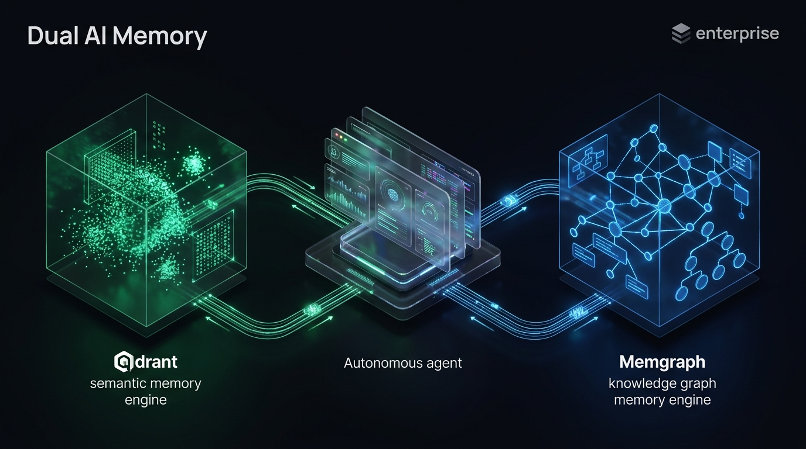
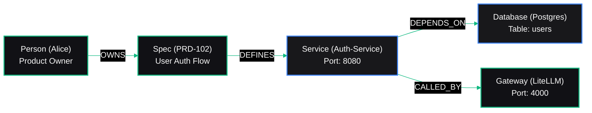

# Vectors Are Not Enough: Why Production Agents Need Both Knowledge Graphs and Qdrant

**How we merged semantic fuzzy search with relational graph traversals (Memgraph) to eliminate hallucinations and context window explosions.**

---


*Figure 1: Dual AI Memory Architecture — Dense semantic vector clusters in Qdrant paired with relational knowledge graph networks in Memgraph.*

---

## 1. The Fundamental Wall of Pure Vector RAG

Over the past two years, the AI community has treated **Vector RAG (Retrieval-Augmented Generation)** as the universal answer to the memory problem. The playbook is well known: take your documentation, split it into 500-token chunks, compute dense embeddings, store them in a vector database, and perform cosine similarity search against user queries.

For basic search engines, this works reasonably well.

However, the moment you task an autonomous agent with navigating **complex enterprise software systems**, pure vector search hits a catastrophic architectural wall:

### The Failure Mode: Relational & Structural Blindness
Imagine asking your autonomous architect agent:
> *"Which upstream microservices and API gateways are impacted if we deprecate the OAuth callback endpoint in Service A, and which teams need to be notified?"*

When a vector database receives this query:
1. It computes a semantic embedding for the prompt text.
2. It searches for chunks containing words like *"OAuth"*, *"callback"*, and *"Service A"*.
3. It retrieves three or four isolated paragraphs that look mathematically "similar" in 1536-dimensional space.

**What it completely misses:**
* It does not know that Service A has a directed dependency on Service B.
* It cannot traverse the network topology to find that Service C consumes Service B.
* It cannot deduce hierarchical team ownership across departments.

Vector embeddings have **no concept of relationships, hierarchies, directed graphs, or multi-hop dependencies**. 

If you attempt to solve this by dumping all documentation into an enormous 200,000-token context window, you pay exorbitant inference bills and trigger "Lost in the Middle" attention degradation.

---

## 2. The Solution: The Dual-Brain Memory Architecture

Human cognition does not rely on a single memory mechanism. The human brain utilizes:
* **Associative / Episodic Memory:** Recalling conceptual similarities, sensory impressions, and fuzzy patterns.
* **Semantic / Structural Knowledge:** Rigid hierarchies, logical relationships, family trees, and spatial maps.

Krümel AI replicates this biology through a **Dual-Brain Memory Architecture**:

| Capability | Associative Memory (Hippocampus) | Structural Knowledge (Neocortex) |
| :--- | :--- | :--- |
| **Engine** | **Qdrant Vector DB (`:6333`)** | **Memgraph Knowledge Graph (`:7687`)** |
| **Storage Model** | Dense Vector Embeddings (HNSW index) | Labeled Property Graph (Nodes & Edges) |
| **Query Mechanism** | Cosine Similarity & Payload Filtering | openCypher Pattern Matching |
| **Best For** | Code snippets, research text, bug logs | Microservice topologies, schemas, ownership |
| **Strengths** | Fuzzy conceptual matching, speed | Exact multi-hop traversals, structural truth |

---

## 3. Deep-Dive: Structured Graph Memory with Memgraph

Memgraph is an ultra-fast, in-memory graph database that speaks the native openCypher query language and connects via the standard Bolt protocol (`neo4j` Python driver).

Inside Krümel AI, our architecture, infrastructure, and team ownership are modeled as a living property graph:



When `agent-architect` is asked to evaluate an infrastructure change, it does not guess with vectors. It executes an exact Cypher query:

```cypher
MATCH (target:Service {name: 'Auth-Service'})<-[:DEPENDS_ON*1..3]-(consumer:Service)
MATCH (target)<-[:DEFINES]-(spec:Spec)<-[:OWNS]-(owner:Person)
RETURN target, consumer.name, owner.name, owner.email
```

**Result:** The agent receives exact structural ground truth in **3 milliseconds**. Zero hallucinations. Zero context bloat.

---

## 4. Deep-Dive: Semantic Memory with Qdrant

While Memgraph handles structural relationships, **Qdrant** manages unstructured text, research digests, and past problem resolutions.

Inside `kruemel-ai-agents` ([`src/tools/memory_tools.py`](https://github.com/wortkotze/medium-kruemel-ai-agents/blob/main/src/tools/memory_tools.py)), agents possess two simple yet powerful memory operations:

```python
from qdrant_client import QdrantClient
from qdrant_client.models import PointStruct
from src.core.config import settings

client = QdrantClient(url=settings.QDRANT_URL) # http://litellm-qdrant:6333

def remember_knowledge(topic: str, content: str, category: str = "general") -> str:
    """Persists an insight, bug fix, or research finding into Qdrant."""
    vector = generate_embedding(content)
    client.upsert(
        collection_name="kruemel_knowledge",
        points=[PointStruct(
            id=generate_uuid(),
            vector=vector,
            payload={"topic": topic, "content": content, "category": category}
        )]
    )
    return "Knowledge stored successfully."

def recall_knowledge(query: str, limit: int = 3) -> str:
    """Performs cosine similarity search against persistent vector memory."""
    query_vector = generate_embedding(query)
    hits = client.search(
        collection_name="kruemel_knowledge",
        query_vector=query_vector,
        limit=limit
    )
    return format_results(hits)
```

---

## 5. The Hybrid GraphRAG Pattern in Action

How do the five autonomous agents orchestrate both engines during a complex real-world task?

### Scenario: Refactoring a Database Schema
1. **Step 1: Graph Traversal (Memgraph):**  
   `agent-architect` queries Memgraph to identify every service connecting to the targeted database table. It retrieves exact service names, port numbers, and designated code owners.
2. **Step 2: Semantic Retrieval (Qdrant):**  
   With the exact list of impacted services in hand, `agent-coder` queries Qdrant for past bug reports, ADR decisions, and code snippets related *specifically* to those identified services.
3. **Step 3: Synthesis & Action:**  
   The agent generates a comprehensive Pull Request and Architecture Decision Record (ADR) that respects both topological reality and historical context.

---

## Key Takeaways

1. **Vectors Find Similarity; Graphs Find Truth:** Dense embeddings cannot answer relational or multi-hop dependency questions.
2. **Combine In-Memory Graphs with HNSW Vector Stores:** Pairing Memgraph with Qdrant delivers the speed of vector search alongside the precision of graph databases.
3. **Stop Bloating Context Windows:** Using graph queries to fetch exact structural subgraphs prevents context window degradation and cuts token costs by over 70%.
4. **Model Architecture as a Living Graph:** Exposing Cypher query tools to your agents enables them to reason about software boundaries like human senior architects.

---

*Explore the complete GraphRAG dual-memory setup on GitHub:*  
👉 **[GitHub: wortkotze/medium-kruemel-ai-infra](https://github.com/wortkotze/medium-kruemel-ai-infra)**  
👉 **[GitHub: wortkotze/medium-kruemel-ai-agents](https://github.com/wortkotze/medium-kruemel-ai-agents)**
